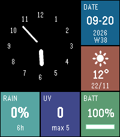
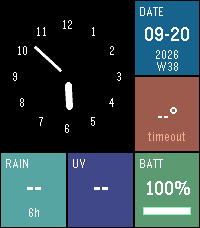

# Metro Analog

An analog watchface for the Pebble Time 2, laid out as a three-by-three tile grid in the
manner of Windows Phone's Metro. The clock takes the top-left four cells with numerals for
all twelve hours; the remaining five tiles carry the ISO date with week number, current
weather, rain probability for the next six hours, the UV index and the watch battery.



When there is no weather data the tile says why, rather than going blank:



`no link` means the watch cannot reach the phone, `no net` means the phone cannot reach the
weather API, `timeout` means neither callback came back.

## Requirements

Pebble Time 2 only (platform `emery`, 200×228, 64 colours). The face is written in
JavaScript against [Alloy](https://developer.repebble.com/guides/alloy/), which supports
`emery` and `gabbro` and no earlier platform.

## Build

```
sudo apt install nodejs npm libsdl2-2.0-0 libglib2.0-0 libpixman-1-0 zlib1g libsndio7.0
uv tool install pebble-tool
pebble sdk install latest

pebble build
pebble install --emulator emery
pebble screenshot --emulator emery shot.png
```

To put it on a watch, open the built `.pbw` from `build/` on your phone, or follow the
[cloud relay route](https://developer.repebble.com/faqs/): enable Dev Connect in the Pebble
app under Devices → ⋯, then `pebble login` and `pebble install --cloudpebble`.

## Releasing

The first publish has to happen by hand, because creating the appstore record needs a
description and at least one screenshot:

```
pebble login
pebble publish
```

Every release after that is the pipeline's job. `.github/workflows/publish.yml` runs on a
published GitHub release: it fails if the tag disagrees with the version in `package.json`,
then builds and uploads the `.pbw` with `--is-published`, so the new version is live as soon
as the job is green. No emulator runs in CI, so the listing keeps the screenshots taken during
the first publish; to replace them, run `pebble publish` locally.

The job authenticates through a repository secret named `PEBBLE_CREDENTIALS`, whose value is
the whole of `~/.local/share/pebble-sdk/firebase_oauth_storage.json` as `pebble login` writes
it. That file holds a long-lived refresh token for the Pebble developer account. If the job
ever fails on authentication, log in again and replace the secret.

## How the weather works

The phone does the network, not the watch. `src/pkjs/index.js` runs in the Pebble phone app,
takes a position from `navigator.geolocation`, fetches [Open-Meteo](https://open-meteo.com/)
(free, no API key) and sends eight integers to the watch over AppMessage.
`src/embeddedjs/weather.js` receives them and caches the last reading for six hours.

This is the split the [C watchface tutorial](https://developer.repebble.com/tutorials/watchface-tutorial/part4/)
and the [pebblekit-js-weather example](https://github.com/pebble-examples/pebblekit-js-weather)
both use, and it matters more than it looks: fetching on the watch puts an HTTPS client, the
response bytes and a JSON parse inside an XS heap that already reports failed slot allocations
at startup, and it exhausts memory in about twenty seconds once a real response arrives.

Both phone-side callbacks can fail to arrive at all — `getCurrentPosition` has been observed
returning neither success nor error despite its own `timeout`, and a request to an unreachable
host never fired `onerror` or `ontimeout` — so each carries its own deadline. Without those,
a failure is indistinguishable from silence.

## Layout

| | | |
|---|---|---|
| clock | clock | date |
| clock | clock | weather |
| rain | UV | battery |

Columns are 67, 67 and 66 pixels, rows are 76 each, and tiles are inset by one pixel so the
black background shows through as a two-pixel gutter. The dial sits at radius 63 with the
numerals on a ring at 52; the hands start nine pixels out from a centre left deliberately
empty, the hour seven pixels thick and the minute three.

The display is reflective and desaturates everything: a fill specified as RGB 0, 85, 170
measures 22, 99, 141 in a screenshot. Colours are chosen from the 64 the panel can show, which
is two bits per channel, so every channel is 0, 85, 170 or 255.

## Development with an agent

`.claude/skills/pebble-watchface/` is gitignored because upstream publishes no licence. To
restore it:

```
git clone https://github.com/coredevices/pebble-watchface-agent-skill /tmp/pws
mkdir -p .claude/skills && cp -r /tmp/pws/.claude/skills/pebble-watchface .claude/skills/
```

Built against commit `363bac9c8e672d62400fbf1b6e3bd4c8e0faca45`.

## Support

The watchface is free and stays free. If it earns a place on your wrist, there is a tip jar at
https://ko-fi.com/max_tee.

## Licence

MIT, see [LICENSE](LICENSE).
